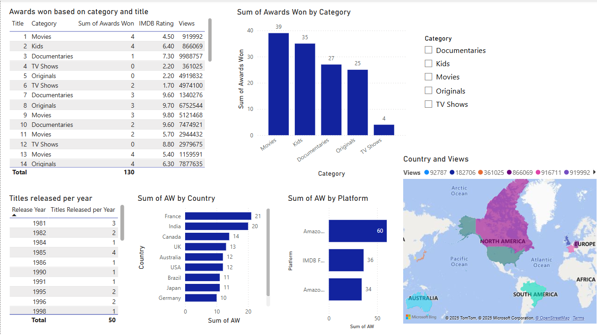

# Amazon Prime Dashboard – Power BI Project Using self-curated dataset.

This project analyzes Amazon Prime content using Power BI. The dashboard provides insights into content type, genre distribution, country-based availability, and trends over time.

The dataset was manually compiled and cleaned to serve as a learning and demonstration tool for data visualization and business intelligence skills.

This dashboard was developed as part of a data storytelling and visualization case study using Power BI.

## Tools Used
- Power BI Desktop
- Execl dataset
- DAX for calculated measures

## Project Files
- `Amazon_prime_dashboard.pbix`: The Power BI report
- `Amazon prime database.xlsx`: The dataset used
- `dashboard_preview.png`: Screenshots of the dashboard visuals

## Key Features
- Content type distribution
- Genre popularity and trends
- Country-wise content availability
- Release year and rating analysis

## Dashboard Preview

> Note: Open the `Amazon_prime_dashboard.pbix` file in Power BI Desktop to explore the interactive dashboard.
